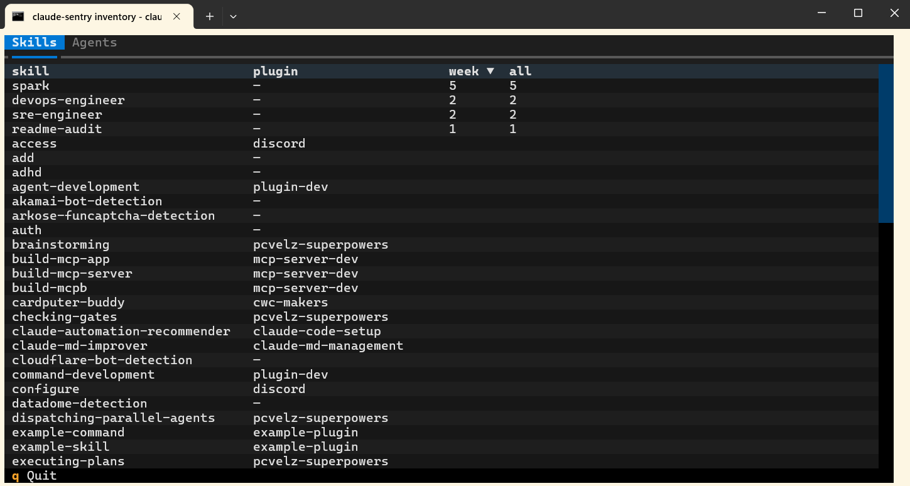

# claude-sentry


**See what Claude Code is touching — live.** A sidebar that shows every file it
edits, skill and agent it runs, and tool it calls, so you never scroll back
through the transcript to find out what changed.

```bash
# Full install — sidebar TUI + audit CLIs
pipx install 'git+https://github.com/trob9/claude-sentry.git[tui]' && claude-sentry-install

# Lightweight install — audit CLIs only, no TUI dependency
pipx install 'git+https://github.com/trob9/claude-sentry.git' && claude-sentry-install --audit-only
```


- **Activity** (top): files this session edited/created/deleted, with line
  add/remove counts and how long ago. Deleted or missing files show in red.
- **Skills / Agents / Tools** (bottom tabs): what the session invoked. Skills and
  Agents show per-session, 7-day, and all-time counts; Tools is per-session.
- **Unconfirmed** (bottom tab): a review queue. Anything that *looks* like a
  skill or agent but isn't installed on disk and isn't a known Claude built-in —
  a typo, or a brand-new command — lands here instead of cluttering the real
  lists. Click the green ✓ to confirm it (it moves into Skills/Agents), the red
  ✗ to dismiss it for good, or the yellow ↻ to **rename** it (when a skill has
  changed names and you want past events to roll up under the new canonical
  name). Use **✓ Confirm all** / **✗ Deny all** at the top to clear the list
  in one click. Your decisions are saved permanently.

Claude's **built-in** skills and agents (`verify`, `code-review`,
`general-purpose`, …) are recognised out of the box, shown with a `(native)`
tag. Clicking one opens a small menu with a deep link to that command's entry in
the [Claude docs](https://code.claude.com/docs/en/commands).

Left-click a row to select it. Right-click (or press `m`) opens a context menu —
**Open file**, **Show in file browser**, **Copy path**. Press `v` (or click
*View all installed*) to open a separate window listing every skill and agent on
the machine with global usage counts.

**Path display:** open Settings (`s` or `Ctrl+P`) and pick how Activity shows
paths — *filename only* (`app.py`), *filename + 1 folder* (`claude-sentry/app.py`),
or *full path* (`~/Projects/claude-sentry/app.py`). The choice persists. Rows are
always de-duplicated by the full path, so changing the display never splits or
merges files.

---

## Audit which skills and agents you actually use

Skills, agents, and plugins pile up fast — but which ones earn their keep? Press
`v` (or click *View all installed*) for the full inventory: every skill and agent
on your machine, the plugin it came from, and a **this-week** and **all-time**
count of how often you've actually run it. Sort by usage and the picture is
instant — what you lean on every day, what you forgot you installed, and what's
safe to prune.



---

## Why not just scroll the transcript?

You can — but the transcript interleaves Claude's prose with its tool calls, so
finding "which files actually changed" means reading past everything else, and
the answer scrolls away as the session grows. claude-sentry pulls just the
**signal** into a fixed pane: a deduplicated list of touched files (newest
first, deletions in red, with line counts), and a running tally of which skills,
agents, and tools the session leans on. It updates live, so it's a glance, not a
search. Nothing to query, nothing to scroll.

---

## What it needs to work

claude-sentry has two moving parts:

1. **The TUI** — a Python/[Textual](https://textual.textualize.io/) app you run
   in a terminal. This part works on Windows, macOS, and Linux.
2. **Hooks** — small commands Claude Code runs automatically on each tool call.
   They write one line per event to a log file the TUI reads. Without the hooks,
   the TUI runs but shows nothing, because nothing is feeding it data.

> **Why hooks?** Claude Code can't push live data into another window on its own.
> But it can run a command after every tool it uses (a "hook"). We register a
> hook that appends each Edit/Write/Bash/Skill/Task event to
> `~/.claude/sentry/events.jsonl`. The TUI tails that file. So the hook is the
> bridge between Claude and the sidebar — that's the one piece of setup you
> can't skip.

---

## Setup (2 steps)

**Prerequisite:** Python ≥ 3.10. ([pipx](https://pipx.pypa.io/) recommended — it
isolates the app and guarantees the commands land on your `PATH`.)

### 1. Install the package

```bash
pipx install 'git+https://github.com/trob9/claude-sentry.git[tui]'
```

> Not on PyPI yet — installing straight from GitHub works today. Once published,
> this becomes `pipx install 'claude-sentry[tui]'`.

The `[tui]` extra pulls in [Textual](https://textual.textualize.io/) for the
sidebar. Skip it (`pipx install 'git+...'` with no extra) to install just the
event log + audit CLIs — see [**Lightweight install (audit only)**](#lightweight-install-audit-only) below.

This puts these commands on your `PATH`:

| Command | What it is | Needs `[tui]` |
|---|---|:-:|
| `claude-sentry` | the sidebar TUI you run | ✅ |
| `claude-sentry-hook` | the logging hook Claude runs (you don't run this yourself) | – |
| `claude-sentry-launch` | the auto-dock hook (Windows Terminal only) | – |
| `claude-sentry-install` | wires the hooks into your Claude settings | – |
| `claude-sentry-report` | print a usage audit of the log (last 30 days by default) | – |
| `claude-sentry-confirm` | mark an unresolved skill/agent as real (headless ✓) | – |
| `claude-sentry-deny` | dismiss an unresolved skill/agent (headless ✗) | – |
| `claude-sentry-rename` | alias an old skill/agent name to its new canonical name (headless ↻) | – |

(Plain `pip install 'git+https://github.com/trob9/claude-sentry.git[tui]'` also
works if you manage your own environment — just make sure the commands land on
your `PATH`.)

### 2. Register the hooks

```bash
claude-sentry-install
```

This edits `~/.claude/settings.json` and adds:

- **`PostToolUse`** hook (matcher `*`) → runs `claude-sentry-hook` after every
  tool call. This is what records edits, deletions, skill/agent/tool usage. It is
  **required** on every platform.
- **`UserPromptSubmit`** hook (matcher `*`) → runs `claude-sentry-hook` on each
  prompt you send, so a `/slash-command` you type is tracked too (those never go
  through the Skill tool, so `PostToolUse` alone can't see them). Every leading
  `/command` is logged; ones that aren't installed or a known built-in land in
  the **Unconfirmed** tab for you to confirm or dismiss, so a typo like `/tset`
  never silently becomes a tracked skill.
- **`SessionStart`** hook (matcher `*`) → runs `claude-sentry-launch`.
  **Windows Terminal only.** It splits a 25%-wide sidebar pane on the right of
  your terminal automatically when a Claude session starts, already linked to
  that session. Pass `--no-launcher` to skip it:

  ```bash
  claude-sentry-install --no-launcher
  ```

The installer is idempotent — running it twice does nothing the second time.

**Restart your Claude session** (or start a new one) so the hooks take effect.

### Uninstall

```bash
claude-sentry-install --uninstall   # removes the hooks
pipx uninstall claude-sentry        # removes the commands
```

---

## Lightweight install (audit only)

Don't want the sidebar — just the data? Skip the `[tui]` extra and pass
`--audit-only` when registering the hooks:

```bash
pipx install 'git+https://github.com/trob9/claude-sentry.git'
claude-sentry-install --audit-only
```

You get:

- the same `~/.claude/sentry/events.jsonl` log of every Edit / Write / Bash /
  Skill / Agent / Tool / slash-command call,
- `claude-sentry-report` for a periodic audit,
- `claude-sentry-confirm` / `claude-sentry-deny` for headless triage of
  unrecognised skill/agent names,

…and **no** TUI, no Textual dependency, no auto-launched sidebar pane.

### Audit your usage

```bash
claude-sentry-report               # last 30 days, human-readable
claude-sentry-report --days 7      # last 7 days
claude-sentry-report --all         # all-time, no window column
claude-sentry-report --json        # machine-readable (good for cron + jq)
```

The report lists **unresolved** items first (anything that looks like a skill
or agent but isn't installed on disk and isn't a Claude built-in), then real
Skills / Agents / Tools usage sorted by all-time count.

### Triage unresolved items

These need a one-time decision — confirm them so they roll into the real counts,
or deny them so they stop showing up:

```bash
claude-sentry-confirm --list                 # show what's unresolved (no changes)
claude-sentry-confirm my-skill               # confirm a single name
claude-sentry-confirm skill::my-skill        # use kind:: prefix if ambiguous
claude-sentry-confirm --all                  # confirm everything pending
claude-sentry-deny    /tset                  # dismiss a typo
claude-sentry-rename  old-name  new-name     # alias old → new (counts merge)
```

`rename` validates that `new-name` is installed on disk or is a native built-in
before saving the alias. Once aliased, every past and future event for
`old-name` rolls up under `new-name` in both the sidebar and the audit report.

Decisions are saved to `~/.claude/sentry/confirmations.json` — the same file
the sidebar uses, so if you later install `[tui]` your existing decisions
carry over.

### Audit on a schedule

A simple monthly cron entry:

```cron
# 1st of every month at 9am — mail me a usage audit for the previous 30 days
0 9 1 * * /usr/local/bin/claude-sentry-report --days 30 | mail -s "claude usage audit" me@example.com
```

Or pipe `--json` into `jq` to flag skills you haven't run in the last 30 days:

```bash
claude-sentry-report --json --days 30 | \
  jq -r '.skills.real | to_entries[] | select(.value.window == 0) | .key'
```

---

## Running it

```bash
claude-sentry                       # global mode — activity across ALL sessions
claude-sentry --session <uuid>      # scope to one Claude session
claude-sentry --inventory           # full-window catalogue of installed skills/agents
```

### Linking to your current chat

The sidebar filters its Activity pane to a single Claude session. There are three
ways it learns which one:

- **Windows Terminal, auto-launched:** the `SessionStart` hook passes the session
  ID for you. Nothing to do.
- **Manual start in the same WT window:** `claude-sentry` re-reads the session the
  hook recorded for that window, so a restart re-attaches automatically.
- **Anywhere else (global mode):** when you run bare `claude-sentry` with no
  session, it opens in **global mode** and pops up a Link dialog. To link it:
  run **`/status`** in your Claude session to see its session ID, then paste the
  UUID into the dialog. You can re-link any time with the **`l`** key.

---

## Keys

| Key | Action |
|---|---|
| `+` / `−` | resize the divider — grows/shrinks the focused pane |
| `o` | open the selected file with the OS default app |
| `r` | reveal the selected file in your file manager |
| `c` | copy the selected file's path to the clipboard |
| `m` | open the right-click context menu for the selected row |
| `v` | open the full inventory window |
| `l` | link this sidebar to a Claude session (paste a UUID) |
| `s` / `Ctrl+P` | open Settings (the command palette — themes, etc.) |
| `q` | quit |
| `Enter` | activate the selected row / confirm a dialog |
| `Esc` | close a dialog or the command palette |

Theme changes (Settings → "Change theme") persist across launches.

---

## How it stores data

```
~/.claude/sentry/
  events.jsonl        # one JSON line per tool call, append-only (auto-trimmed)
  config.json         # divider position, theme, path-display mode
  confirmations.json  # your confirm/deny decisions for the Unconfirmed tab
  debug.log           # last few swallowed errors (only if something went wrong)
  win-session/        # records which Claude session is active per WT window
  locks/              # per-window guards so the pane only auto-launches once
```

`events.jsonl` is plain JSON-lines — safe to read, archive, or delete. Deleting
it resets all counts; the hooks repopulate it as you keep working. It's kept
bounded automatically (trimmed to the most recent lines once it grows large).

---

## Troubleshooting

**The sidebar stays empty.** The hooks fail silently by design (so they never
break a tool call), so an empty pane usually means one of:

- You haven't **restarted your Claude session** since running
  `claude-sentry-install` — hooks only load at session start.
- The sidebar isn't **linked** to the session you're using — press `l` and paste
  the ID from `/status` (or run `claude-sentry --all-sessions` to see everything).
- The hook command isn't on `PATH`. Check whether `~/.claude/sentry/events.jsonl`
  exists and grows as you work; if it never appears, run `claude-sentry-hook` in a
  shell to confirm it's found, and look at `~/.claude/sentry/debug.log` for the
  reason.

---

## Platform notes

The TUI and the logging hook work in every terminal on every OS — they're just
Python. What varies between terminals is **whether you can dock claude-sentry
as a side pane** in the same window as Claude. That depends on the terminal,
not the OS.

| Terminal | Native splits | Auto-dock + auto-link |
|---|---|---|
| **Windows Terminal** | yes | ✅ built-in (`claude-sentry-launch`) |
| **Kitty** (macOS / Linux) | yes | ✅ via [`examples/kitty/`](examples/kitty/) |
| **iTerm2** (macOS) | yes | ✅ via [`examples/iterm2/`](examples/iterm2/) |
| **tmux / zellij / screen** (inside any terminal) | yes | possible — no example shipped yet |
| **Terminal.app** (macOS), **gnome-terminal** | **no** | use two windows side-by-side, or run `tmux`/`zellij` inside it |

If your terminal has no native splits and you don't want a multiplexer, just
run `claude-sentry` in a second window next to Claude — auto-link via
`CLAUDE_SENTRY_LINK_ID` still works regardless of how the panes are laid out.

Open-with-default and reveal-in-file-manager are wired per OS: `os.startfile` on
Windows, `open` / `open -R` on macOS, `xdg-open` on Linux. The inventory window
spawns via Windows Terminal, `osascript` on macOS, or a detected terminal on
Linux.

### Kitty setup

Kitty has no built-in way to drag the split edge — you resize via keybinds. Add
to `~/.config/kitty/kitty.conf`:

```
enabled_layouts splits,stack

map cmd+alt+right resize_window wider 5
map cmd+alt+left  resize_window narrower 5
```

Then reload with `ctrl+shift+f5`. Focus the claude-sentry pane and press
`cmd+alt+right` to widen it (5 columns per press), `cmd+alt+left` to narrow.
On Linux swap `cmd` for `ctrl`.

### Launcher integration (auto-link + `/resume` support)

By default you press `l` to link claude-sentry to a session. If you write a
small launcher script, claude-sentry can link automatically — and re-link when
you run `/resume` — without any manual step.

**The contract** — your launcher must do two things:

1. **Set `CLAUDE_SENTRY_LINK_ID`** to a fresh UUID and export it to both the
   Claude pane and the claude-sentry pane before either starts.
2. **On each `SessionStart` hook** (fires when Claude creates or resumes a
   session), write the new `session_id` to
   `~/.claude/state/sentry-links/$CLAUDE_SENTRY_LINK_ID.json`.

That's it — no signals, no PID tracking. claude-sentry polls the state file on
its 2-second refresh tick: when the `session_id` changes (typically after a
`/resume`), it re-scopes within ~2 s. If `CLAUDE_SENTRY_LINK_ID` is not set it
falls back to the normal manual-link behaviour.

**Multiple windows are isolated:** each Claude+sentry pair has its own
`CLAUDE_SENTRY_LINK_ID` and its own state file, so two windows on different
sessions never cross. Two windows on the *same* session will both show the
merged tool activity (same `session_id` in the log).

**Reference implementation for Kitty (macOS/Linux):** see
[`examples/kitty/`](examples/kitty/) for a ready-to-use launcher script and a
SessionStart hook snippet you can paste into your existing hook file.

---

## Development

```bash
git clone https://github.com/trob9/claude-sentry.git && cd claude-sentry
python -m venv .venv && .venv/bin/pip install -e '.[tui]'   # drop [tui] for audit-only dev
claude-sentry-install
```

With an editable install (`-e`), edits to `claude_sentry/` take effect on the
next launch. Module layout:

| File | Role |
|---|---|
| `claude_sentry/core.py` | pure-Python primitives (paths, event loader, native built-ins, confirmations, aggregation) — zero deps, shared by everything below |
| `claude_sentry/app.py` | the sidebar TUI (imports `core`, requires `[tui]`) |
| `claude_sentry/hook.py` | the logging hook Claude runs after every tool call |
| `claude_sentry/launch_hook.py` | the Windows-Terminal auto-dock hook |
| `claude_sentry/install.py` | wires the hooks into `~/.claude/settings.json` |
| `claude_sentry/report.py` | `claude-sentry-report` audit CLI |
| `claude_sentry/triage.py` | `claude-sentry-confirm` / `claude-sentry-deny` CLIs |
| `claude_sentry/_tui_entry.py` | shim that prints a friendly error if `[tui]` isn't installed |

---

Found a bug or have an idea? [Open an issue](https://github.com/trob9/claude-sentry/issues).
If claude-sentry saves you a scroll, a ⭐ helps other people find it.
